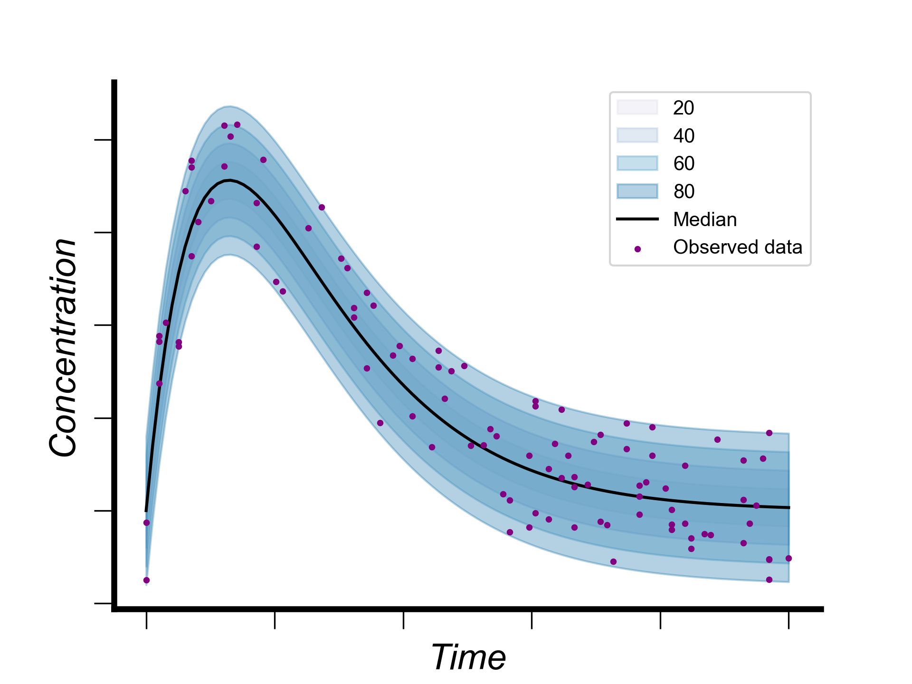

# Fictious population PK plot
Fictional population pharmacokinetics (PKs) plot showing drug levels in the absorption compartment, based on a simple two-compartment model for a single bolus dose (thi plot has been used in figure 5 of our [review article on CAR T-cell kinetics modelling published in eBiomedicine](https://doi.org/10.1016/j.ebiom.2025.105597)).

